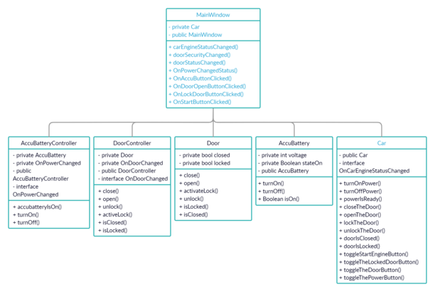

# The Next Car

### Functionality
- dapat mengecek apakah pintu masih terbuka atau tidak
- dapat mengecek apakah pintu sudah terkunci atau belum
- dapat mengecek apakah Accu sudah menyala atau belum

### Tugas

1. Class Diagram



2. Kegunaan DoorController.cs
- untuk membuka/menutup pintu jika tombol dipencet
- untuk mengecek apakah pintu sudah di kunci atau belum

3. Kegunaan Model Door.cs
- untuk mengatur fungsi door apakan tertutup atau terbuka
- untuk mengatur fungsi lock apakah terkunci atau terbuka
- mengecek apakah pintu terkunci/tertutup

4. Kegunaan interface ```OnDoorChange```
- digunakan untuk menampilkan hasil pada fungsi ```doorSecurityChanged``` dan ```doorStatusChanged``` ketikan tombol di klik
